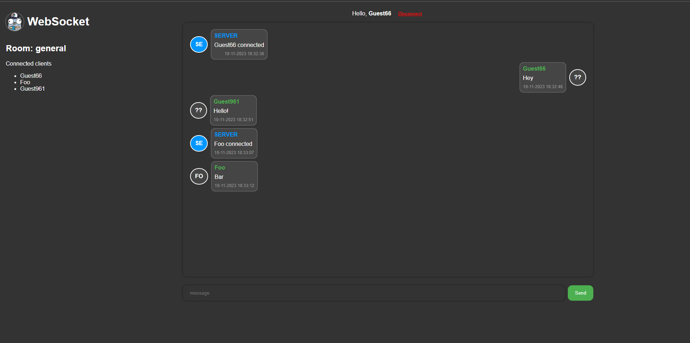

# Go WebSocket

## Overview

This is a simple websocket chat application.

The server and client were written in [Go](https://golang.org) and [VueJS](https://vuejs.org).

## Features

- [x] Choose a nickname
- [x] Choose a room (multiple chat rooms support)
- [x] Send messages
- [x] See who is online in the room
- [x] Connected clients list updated in real time
- [x] Disconnect from the room
- [x] Share room directly with URL link
- [x] Notifications from the server when someone joins or leaves the room
- [x] Notifications of unread messages in the browser tab + sound
- [x] Connected room displayed in the browser tab
- [x] Scroll down to the last message when a new message is received
- [x] Nickname saved in the browser local storage
- [x] Dark theme
- [x] Responsive design
- [x] See who is typing
- [x] Different colors for each user
- [x] Anti lurker system (the user must send a message to show their color in the list of connected clients)
- [x] Unique nickname per room
- [ ] Send links
- [ ] Auto reconnect to the server when connection is lost

## Example



## Dependencies

The websocket packaged used in this project is:

- [x] [nhooyr.io/websocket](https://github.com/nhooyr/websocket)

## Run

### Testing the app locally

The `./public/script.js` file has a `ENVIRONMENTS` const that can be used to
switch between the local server and the production server.

1. find and replace the `ENVIRONMENTS` const in `./public/script.js`:

   search for `.PROD.` and replace it with `.DEV.`

   ```bash
   :%s/\.PROD/.DEV/g
   ```

2. run the server:

   ```bash
   go run ./main.go
   ```

### Connect to the server only

To open a new WebSocket connection to the server, you have to pass the following query parameters:

- `nickname`: the nickname of the user
- `room`: the room name (optional, default: `general`)

Example:

1. Connect to the `general` room with the nickname `John`:

   ```javascript
   const ws = new WebSocket(
     `ws://localhost:3000/ws?nickname=John&room=general`
   );
   ```

2. Subscribe to see the messages from the ws:

   ```javascript
   ws.onmessage = (event) => {
     console.log(event.data);
   };
   ```

   if you don't want to get spammed with the notifications, you can filter the messages:

   ```javascript
   ws.onmessage = (event) => {
     const data = JSON.parse(event.data);
     if (data.type === "message") {
       console.log(data);
     }
   };
   ```

3. Send a message to the server:

   You can send two types of messages to the server: `message` and `notification`.

   - `message`: a message that will be displayed in the chat
   - `notification`: the sender will be added to a list of who is typing (displayed below the chat)

    3.1. Payload message format:

   ```json
   {
       "type": "message", // accepted values: "message", "notification"
       "from": {
           "nickname": "John", // sender nickname
           "color": "#000000" // hexadecimal color (optional: default: #000000)
       }
       content: "Hello world!" // required for type "message"
       isTyping: true // boolean required for type "notification"
   }
   ```

   3.2. Sending a Hello world! message:

   ```javascript
   ws.send(
     JSON.stringify({
       type: "message",
       from: {
         nickname: "John",
         color: "#000000",
       },
       content: "Hello world!",
     })
   );
   ```
