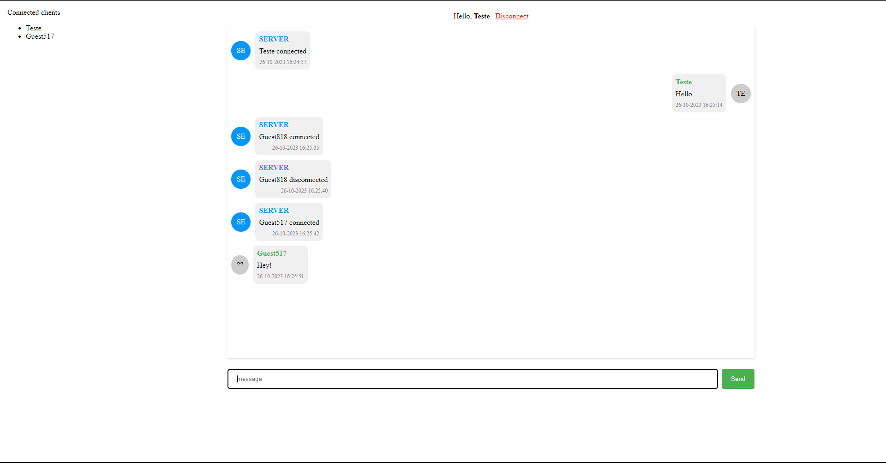

# Go WebSocket

## Overview

This is a simple websocket chat application.

The server and client were written in [Go](https://golang.org) and [VueJS](https://vuejs.org).

## Example



## Dependencies

The websocket packaged used in this project is:

- [x] [WebSocket](https://pkg.go.dev/nhooyr.io/websocket)

## Usage

```bash
go run ./main.go
```
